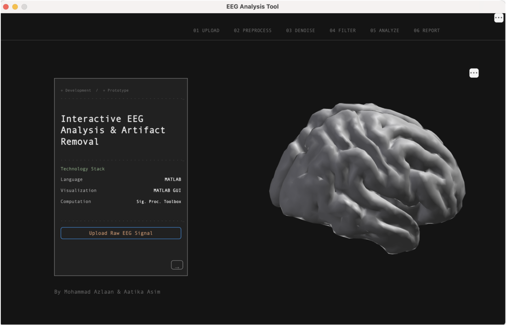
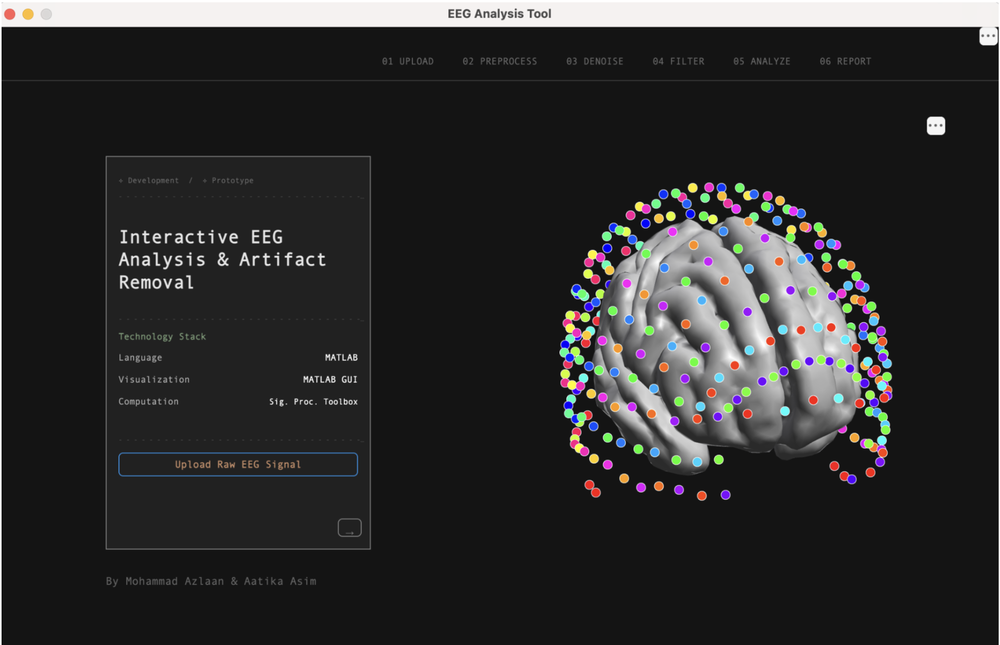
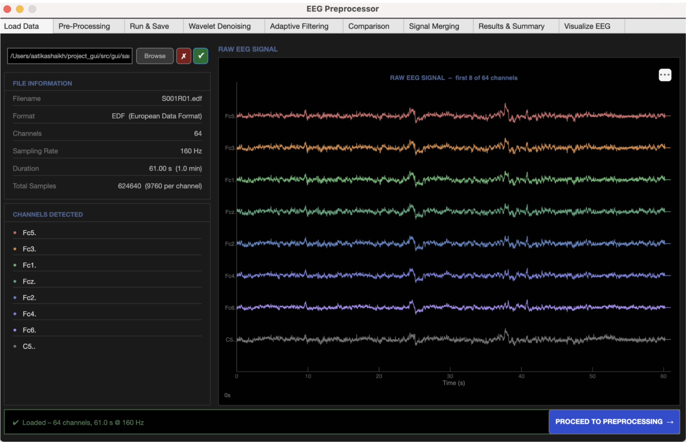

# EEG_gui

A lightweight GUI application for loading, visualizing, and interacting with EEG (electroencephalography) data.

## Table of Contents
- [About](#about)
- [Screenshots](#screenshots)
- [Features](#features)
- [Requirements](#requirements)
- [Installation](#installation)
- [Usage](#usage)
- [Data format](#data-format)
- [Configuration](#configuration)
- [Development & Contributing](#development--contributing)
- [License](#license)
- [Contact](#contact)

## About
EEG_gui is a graphical interface to explore EEG recordings, perform preprocessing and denoising, and visualize channels and topographies. It is built to make common EEG tasks simple and interactive.

## Screenshots
Below are three screenshots from the application. I updated the README to use the image files you uploaded into `docs/screenshots/`.

- Image 1 — Landing / 3D brain model

- Image 2 — Landing animation / electrode overlay

- Image 3 — Channel timeseries view (raw EEG signal)

## Features
- Multi-channel plotting with zoom/pan
- Channel selection and re-ordering
- Wavelet denoising and adaptive filtering
- Export processed data and snapshots
- Simple pipeline: Upload → Preprocess → Denoise → Filter → Analyze → Report

## Requirements
- Python 3.8+ (if using Python version)
- Recommended libraries: numpy, scipy, matplotlib, PyQt5 (or PySide6)
- Optional: mne for EDF/BDF IO

(Update the requirements above to match your actual implementation / MATLAB toolboxes if you use MATLAB.)

## Installation
1. Clone:
   git clone https://github.com/aatika22660-lang/EEG_gui.git
2. Enter directory:
   cd EEG_gui
3. Create a venv:
   python -m venv .venv
   source .venv/bin/activate  # macOS/Linux
   .venv\Scripts\activate     # Windows
4. Install dependencies:
   pip install -r requirements.txt

(If this repo is MATLAB-based, replace the Python steps with your MATLAB installation / toolbox notes.)

## Usage
Run the app (example):
python main.py --file path/to/data.edf

Walkthrough:
1. Upload an EEG file.
2. Preview channels and file metadata.
3. Proceed to preprocessing / denoising modules.
4. Visualize results and export.

## Data format
Common supported formats (adjust as needed):
- EDF / BDF (via MNE or custom reader)
- CSV (samples x channels)
- NumPy .npy arrays

Document any required headers or metadata (channel names, sample rate, montage).

## Configuration
- Default sample rate: 256 Hz (example)
- Config file: config.yaml (optional)
- Save/export path: `exports/` (example)

## Development & Contributing
1. Fork the repository.
2. Create a branch: `git checkout -b feat/your-change`
3. Commit and open a PR with a clear description.

Developer notes:
- Main GUI code: src/ or gui/
- Entry point: main.py or run_app.m (MATLAB) — update this to match your project.

## License
Specify your license (e.g., MIT). See LICENSE file.

## Contact
Maintainer: Your Name <youremail@example.com>  
Repo: https://github.com/aatika22660-lang/EEG_gui
